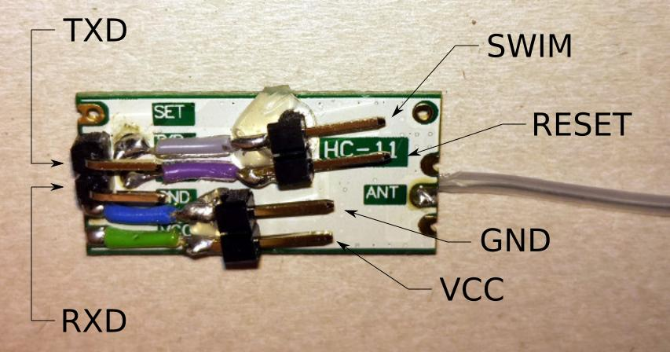

# Wildlife tracking tag

This is an implementation of a wildlife tracking tag based on an HC-11 module.
HC-11 modules contain a stm8s003f3 microcontroller that controls a CC1101 RF
chip. The implemented open source firmware makes the tag emit a long CDMA code
sequence at approximately every second and the go back to sleep. Receive mode
of the CC1101 is not used at all. The long code sequence enables one or more
receivers to detect the tag at large distances. Additionally they might
determine its location using trilateration or triangulation. Usage of the
sleeping modes on both chips in between transmissions enables a long battery
lifetime.

## Requirements

- HC-11 with pins soldered to RST, SWIM, (both on test pads) GND and 3.3V

- ST-LINK/V2 programmer
- USB to UART adapter for debugging (optional but useful, needs additional pins
  on the HC-11 soldered to TXD and RXD)
- SDCC >= 3.8
- stm8flash

## Related links and additional information

- <https://mvdlande.wordpress.com/2016/09/03/reprogramming-a-hc-11-cc1101-433mhz-wireless-transceiver-module/>
- <https://christian.panton.org/hc11-reflashing.html>
- <https://github.com/gulamf/HC11>
- <https://github.com/lujji/stm8-bare-min>
- <http://sdcc.sourceforge.net/>
- <https://github.com/vdudouyt/stm8flash>
